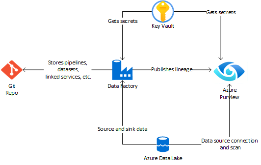

## 🌐 Terraform Template for Microsoft Purview and Data Lake Environment

### 📝 Description

This repository contains a Terraform template designed to automate the deployment of a Microsoft Purview and Data Lake environment in Azure. By using this template, you can quickly provision and configure all the necessary Azure resources, saving you time and reducing the possibility of manual errors. This is particularly useful for organizations that require a robust and secure data governance and data lake solution but want to minimize the operational overhead.

### 🎯 Why Use This Repository?

- 🚀 **Quick Deployment**: Get your Purview and Data Lake environment up and running in minutes.
- 🛡 **Consistency**: Ensure that all deployments follow the same configuration, reducing inconsistencies.
- 📚 **Documentation**: Each component and its purpose are well-documented, making it easier to understand what is being deployed.
- 🔄 **Reusability**: The template can be reused across different environments and Azure subscriptions.

### 🏗 Architecture

### 📋 Prerequisites

- 🌟 An active [Azure subscription](https://azure.microsoft.com/en-us/free/).
- 🛠 Terraform installed on your local machine or a CI/CD pipeline.
- 💻 Azure CLI installed and authenticated.
- No **Azure Policies** preventing creation of **Storage accounts**

### 🚀 Usage

1️⃣ Clone this repository to your local machine.  
2️⃣ Navigate to the directory containing the Terraform files.  
3️⃣ Run `terraform init` to initialize the Terraform configuration.  
4️⃣ Run `terraform plan` to see the resources that will be created.  
5️⃣ Run `terraform apply` to apply the changes and create the resources.

> 📝 **Note**: You can customize the variables in the `locals` block within the Terraform script to suit your specific needs.

### ✅ Outcome

- 🕒 The template should take approximately 10 minutes to complete.
- 🌐 Once complete, all Azure resources will have been provisioned.

### 🛠 Validate Deployment

1️⃣ Navigate to the Azure Portal, locate your **Resource Group**, click **Deployments**. You should see that the deployment has **Succeeded**.  
2️⃣ Within your resource group, you should see the following set of Azure resources: Purview Account, Key Vault, Data Lake Storage Account, Data Factory.  
3️⃣ Navigate to your Microsoft Purview Account, click **Open Governance Portal** > **Data Map**. You should see the registered Data Lake Storage Account.  
4️⃣ Navigate to **Data Map** > **Collections** > **Role assignments**. You should see your user added to each role (Collection admin, Data Source admin, Data curator, Data reader).

### 📦 Deployed Resources

- 🏦 Microsoft Purview Account
- 🔐 Azure Key Vault
- 🗃 Azure Data Lake Storage Gen2 Account
- 🏭 Azure Data Factory

### 🎫 Role Assignments

| #  | Scope                   | Principal            | Role Definition          |
|----|-------------------------|----------------------|--------------------------|
| 1  | Azure Data Lake Storage | Current User         | Storage Blob Data Reader |
| 2  | Azure Data Lake Storage | Microsoft Purview MI | Storage Blob Data Reader |
| 3  | Azure Data Lake Storage | Azure Data Factory MI| Storage Blob Data Contributor |

### 📊 Data Plane Operations

| #  | Service         | Action                         |
|----|-----------------|--------------------------------|
| 1  | Azure Key Vault | Store Purview Credentials      |
| 2  | Azure Data Lake Storage Gen2 | Create Containers (Bronze, Silver, Gold) |
| 3  | Microsoft Purview| Register Data Lake as Source   |
| 4  | Microsoft Purview| Create and Run Scans           |
| 5  | Azure Data Factory| Execute Data Movement Pipelines |
| 6  | Microsoft Purview| Populate Glossary Terms        |
| 7  | Microsoft Purview| Assign Data Classifications    |
